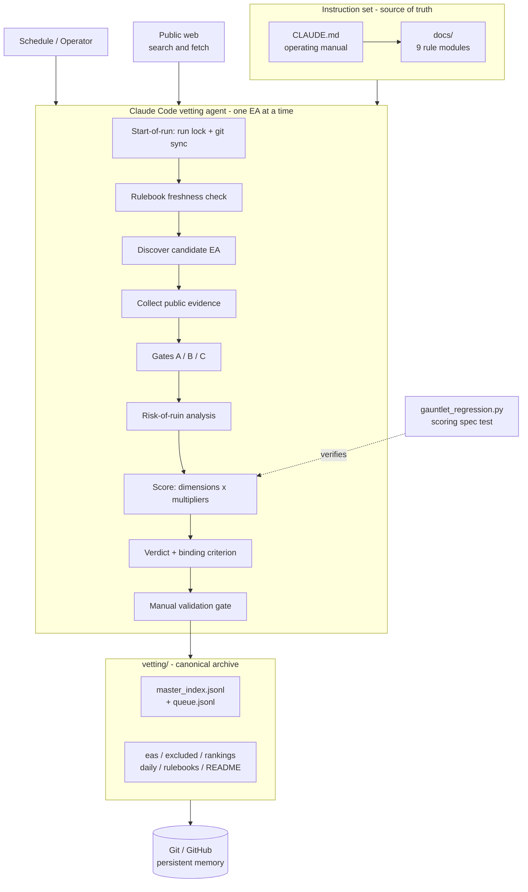

# The Gauntlet

**An adversarial, evidence-first vetting agent for MT5 Expert Advisors (EAs) used in prop-firm challenges.**

The Gauntlet is an autonomous research routine that runs inside [Claude Code](https://claude.com/claude-code). Each run it discovers publicly available MetaTrader 5 Expert Advisors, gathers only verifiable public evidence about them, and estimates a single hard question: *what is the realistic probability that this EA can pass a proprietary-trading-firm evaluation **and** survive to repeated payout on a funded account?*

It is a skeptic by design. Its entire behaviour is defined by a versioned instruction set — there is no application code to deploy; the repository **is** the agent's manual and its long-term memory.

---

## Overview

| | |
|---|---|
| **What it does** | Researches currently available MT5 EAs from public sources and produces an auditable verdict on each. |
| **Why it exists** | EA marketing is mostly unverifiable and prop-firm rules change without notice. The agent's job is to resist both — to avoid scoring a well-marketed but unproven EA, and to avoid judging an EA against a stale rulebook. |
| **Problem it solves** | Separates *passing a challenge* from *surviving a funded account* — two different problems — using independent, immutable evidence rather than vendor claims. |
| **Intended users** | Quantitative researchers and prop-firm traders evaluating third-party EAs; anyone wanting an evidence-graded archive instead of affiliate "best EA" lists. |
| **Primary outcome** | A structured, version-controlled archive: per-EA profiles, verdicts, scores, rankings, and per-firm legality — every claim traceable to a fetched source. |

**Operating constraint (important):** the agent works from **public web evidence only**. It has no access to EA source code, `.ex5` binaries, `.set` files, MT5 terminals, broker accounts, or funded dashboards. When a mechanism or result cannot be established from public sources, that absence *is* the finding.

> A near-empty Watchlist and an empty Deployable list are the filter working, not failing.

---

## Key Features

All features below are implemented in the instruction set and exercised by the archived data.

| Feature | Summary |
|---|---|
| **Adversarial EA vetting** | One EA at a time, end to end, with a mandatory "Why This Will Probably Fail" step before any score. |
| **Public-evidence research protocol** | Defined search sequences, a mandatory negative-case search, and per-source distrust rules (`docs/research-protocol.md`). |
| **Evidence-tier grading** | Every figure tagged Tier 0–4 (incl. Tier 2A real-money vs 2B demo/hidden) so marketing can't inflate a score. |
| **Eligibility gates** | Gate A (banned mechanism), Gate B (black-box ceiling), Gate C (per-firm legality) applied *before* scoring. |
| **Weighted scoring engine** | 7 weighted dimensions × evidence multipliers + gate ceilings → a deterministic Overall (`docs/scoring-and-verdicts.md`). |
| **Risk-of-ruin analysis** | Estimated only from real-money trade-level history; otherwise explicitly `NON-ESTIMABLE`. |
| **Rulebook system** | Versioned per-firm rulebooks with a 72-hour freshness check and bounded re-checks. |
| **Git-based persistence & recovery** | Git is the canonical memory; run locks, stash/recovery branches, and halt notifications guard every run. |
| **Outcome tracking** | A calibration ledger for realized-vs-predicted results (operator-supplied). |
| **Scoring regression suite** | `gauntlet_regression.py` asserts the verdict logic against 7 EA archetypes. |

---

## How It Works

Each run is a sequence of phases governed by `CLAUDE.md` and the `docs/` modules. EAs are processed **one at a time** — each is an atomic transaction that is fully validated and persisted before the next begins.



**Phase order:** start-of-run init (lock + git sync) → rulebook freshness → EA discovery → evidence collection → eligibility gating → risk-of-ruin → scoring → verdict → manual validation → persistence & reporting. Each phase's detailed rules live in the doc that owns it (see [Documentation Guide](#documentation-guide)).

---

## System Architecture

The Gauntlet has **no runtime services** — its "engines" are agent phases driven by specific documents, not separate programs. The only executable code is the scoring regression suite.

| Component | Implemented as | Role |
|---|---|---|
| **Operating manual** | `CLAUDE.md` | Entry point: role, hard rules, run lifecycle, documentation map. |
| **Rule modules** | `docs/*.md` (9 files) | Single source of truth for each phase (research, scoring, rulebooks, etc.). |
| **Research "engine"** | Agent phase + `docs/research-protocol.md` | Discovery, fetching, evidence triangulation. |
| **Scoring "engine"** | Agent phase + `docs/scoring-and-verdicts.md` | Tiers, gates, multipliers, verdicts. |
| **Scoring spec test** | `gauntlet_regression.py` | Asserts the verdict logic against archetypes (Python 3, stdlib only). |
| **Rulebook system** | `vetting/rulebooks/*.md` | Versioned per-firm rules with retrieval dates. |
| **Validation layer** | Agent gate + `docs/validation.md` | Commit-gate checklist; aborts a commit on inconsistency. |
| **Persistence layer** | Git/GitHub + `docs/git-and-persistence.md` | Canonical memory, branching, recovery. |
| **Archive / reporting** | `vetting/` + `docs/output-standard.md` | Index, queue, per-EA pages, rankings, daily reports. |

---

## Repository Structure

```
The-Gauntlet/
├── CLAUDE.md                 # Operating manual (v2.6) — entry point & hard rules
├── gauntlet_regression.py    # Scoring/verdict regression suite (7 archetypes)
├── .gitignore                # Ignores secrets, temp files, and vetting/.run.lock
├── docs/                     # 9 single-source-of-truth rule modules
│   ├── research-protocol.md      # How to vet from public evidence
│   ├── rulebooks.md              # Firm rulebook system & freshness
│   ├── scoring-and-verdicts.md   # Tiers, gates, scoring, verdicts
│   ├── data-model.md             # Repo layout & JSONL schemas
│   ├── output-standard.md        # Page templates & presentation
│   ├── validation.md             # Commit-gate & end-of-run checklists
│   ├── git-and-persistence.md    # Setup, branching, recovery
│   ├── outcomes.md               # Calibration loop
│   └── CHANGELOG.md              # Version history (v2 → v2.6)
└── vetting/                  # Canonical archive (the agent's memory)
    ├── README.md                 # Landing page — live counts & shortlists
    ├── master_index.jsonl        # Canonical index, one JSON object per EA
    ├── queue.jsonl               # Candidate queue with states
    ├── eas/                      # Per-EA profiles (survived the gates)
    ├── excluded/                 # Gate-A exclusions with reasons
    ├── rulebooks/                # Per-firm rulebooks (6 firms)
    ├── rankings/                 # 4 purpose-specific ranked lists
    ├── daily/                    # One report per run
    ├── source_archive/           # Fetched-URL log per run
    ├── deployable/               # Reserved for EAs clearing all gates (none yet)
    └── outcomes/                 # Realized-vs-predicted calibration ledger
```

---

## Documentation Guide

`CLAUDE.md` is the entry point; each `docs/` file is the authoritative source for its area.

| Document | Purpose |
|---|---|
| `CLAUDE.md` | Operating manual: role, hard rules, run lifecycle, documentation map. |
| `docs/research-protocol.md` | Web research protocol — search sequences, source handling, discovery sources. |
| `docs/rulebooks.md` | Firm rulebook system — extraction fields, file format, freshness, re-checks. |
| `docs/scoring-and-verdicts.md` | Evidence tiers, eligibility gates, risk-of-ruin, scoring, verdicts. |
| `docs/data-model.md` | Repository layout and the `master_index` / `queue` JSONL schemas. |
| `docs/output-standard.md` | Output presentation standard and per-run page templates. |
| `docs/validation.md` | Manual validation checklist (commit gate) and end-of-run checklist. |
| `docs/git-and-persistence.md` | One-time setup, branching, persistence, checkpointing, recovery. |
| `docs/outcomes.md` | Realized-vs-predicted calibration loop. |
| `docs/CHANGELOG.md` | Version history (v2 → v2.6). |

---

## Vetting Methodology

The agent treats every advertised performance figure as **unverified and likely inflated** until independent, immutable evidence proves otherwise.

**Evidence tiers** (full definitions in `docs/scoring-and-verdicts.md`):

| Tier | Meaning |
|---|---|
| **Tier 0** | Verified funded-account evidence (payout proof tied to a named firm). |
| **Tier 1** | Independently verified live, real-money, public history ≥ 6 months. |
| **Tier 2A** | Real-money but caveated (short track, low deposit, or small sample). |
| **Tier 2B** | Demo-only, hidden history, or curve-fit. |
| **Tier 3** | Vendor-reported / unverifiable (screenshots, vendor curves, backtests). |
| **Tier 4** | Marketing claim with no inspectable public basis. |

**Core principles:** fetched public pages are the unit of evidence (snippets and summaries are leads only); facts, analysis, and assumptions are kept separate; a risk-of-ruin that cannot be estimated is a *negative* finding, not a neutral gap; when sources conflict, the worse reading is taken.

---

## Scoring Framework

**Eligibility gates** run before any scoring:

| Gate | Checks | Effect |
|---|---|---|
| **A** | Banned core mechanism (martingale, grid/recovery averaging, latency/arbitrage, tick-scalping, news-spike). | **Excluded** — never scored. |
| **B** | Mechanism not publicly verifiable (black box). | Compliance ≤ 5, Risk ≤ 4, verdict ceiling = Watchlist. |
| **C** | Per-firm legality. | Prohibited at all primary firms → **Avoid**. |

**Seven weighted dimensions:** Funded-Survival (30%), Compliance (20%), Risk (15%), Challenge-Passing (15%), Consistency (10%), Transparency (5%), Profitability (5%). Evidence-driven dimensions are multiplied by a tier-based **evidence multiplier**; mechanism dimensions are capped by gate ceilings. The weighted result is the **Overall (1–10)**.

**Verdict categories:**

| Verdict | Meaning |
|---|---|
| **Excluded** | Failed Gate A (banned mechanism). |
| **Avoid** | Prohibited everywhere, Tier 3/4 headline evidence, or non-estimable ROR on weak evidence. |
| **Watchlist** | Promising but unproven — worth chasing more evidence. |
| **Deployable** | Clears all gates *including* funded-account evidence. |

> **Autonomous ceiling = Watchlist.** Funded-account evidence (the Deployable requirement) is essentially unobtainable by web research alone, so an autonomous pass tops out at Watchlist by design. The scoring logic above is verified by `gauntlet_regression.py` (7 archetypes, all passing).

---

## Rulebook Management

Every verdict rests on current per-firm rules; training data is never used for a rule. Details in `docs/rulebooks.md`.

| Aspect | Behaviour |
|---|---|
| **Primary firms** (gate verdicts) | FundedNext, Funding Pips, The 5%ers, The Funded Trader. |
| **Reference firms** (recorded, non-gating) | Alpha Capital Group, Goat Funded Trader. |
| **Freshness** | 72-hour threshold; stale rulebooks are re-fetched before vetting. |
| **Versioning** | Each rulebook carries a retrieval timestamp and an agent-assigned version + change note. |
| **Re-check** | On a version bump, Deployable/Watchlist EAs are re-checked first (bounded, backlog drained before new discovery). |
| **Unreachable source** | Rulebook kept, marked `STALE`, verdicts treated as provisional and capped at `Conditional`. |

---

## Persistence & Recovery

Git is the **primary persistent storage and canonical long-term memory**; local files are treated as a temporary working directory. Full procedures in `docs/git-and-persistence.md`.

| Mechanism | Behaviour |
|---|---|
| **Atomic persistence** | Each EA is validated, committed, pushed, and verified before the next begins. |
| **Run lock** | `vetting/.run.lock` (gitignored) prevents concurrent runs; stale locks (> 6h) are overridden. |
| **Branching** | Direct-to-`main` preferred; a working branch is used only when direct push is blocked, then merged and verified. |
| **Recovery** | Dirty trees are stashed (never hard-reset); unresolved conflicts are preserved on `recovery-*` branches. |
| **Halt notification** | A blocker writes `vetting/NEEDS_ATTENTION.md`, which gates the next run until an operator resolves it. |
| **Checkpointing** | Because every completed EA is already on `main`, an interruption only loses in-progress work. |

---

## Outputs Generated

| Output | Location | Description |
|---|---|---|
| **Landing page** | `vetting/README.md` | Live counts, shortlists, legend, latest-pass link. |
| **Master index** | `vetting/master_index.jsonl` | One JSON object per EA (verdict, tier, scores, firm verdicts). |
| **Queue** | `vetting/queue.jsonl` | Candidate states: `pending`, `vetting`, `completed`, `excluded`. |
| **EA profiles** | `vetting/eas/<slug>.md` | Full vetting pages for EAs that survived the gates. |
| **Exclusions** | `vetting/excluded/<slug>.md` | Gate-A exclusions with the banned mechanism and evidence. |
| **Rankings** | `vetting/rankings/*.md` | Funded-survival, 2-step, 1-step, and full comparison lists. |
| **Daily reports** | `vetting/daily/<date>.md` | Per-run summary, scoreboard, and red flags. |
| **Source archive** | `vetting/source_archive/<date>.md` | Fetched URLs with timestamps and affiliate flags. |
| **Rulebooks** | `vetting/rulebooks/<firm>.md` | Versioned per-firm rules. |

**Current archive snapshot** *(as of 2026-06-24; live counts in `vetting/README.md`):* 15 EAs vetted — **1 Watchlist, 9 Avoid, 5 Excluded, 0 Deployable**.

---

## Installation

This repository is run by a Claude Code agent, not built or installed as an application.

**Prerequisites**

| Requirement | Purpose |
|---|---|
| [Claude Code](https://claude.com/claude-code) with web search/fetch | Runs the agent (Desktop, web, mobile, or headless CLI). |
| A Git remote with write access | Canonical persistence (the agent commits and pushes every run). |
| Python 3 (standard library only) | Runs `gauntlet_regression.py`; no third-party packages. |

**Setup**

```bash
# 1. Clone
git clone <your-remote-url> The-Gauntlet
cd The-Gauntlet

# 2. Configure the agent's git identity (see docs/git-and-persistence.md)
git config user.name  "Gauntlet EA Agent"
git config user.email "gauntlet-agent@your-org.com"

# 3. (Optional) verify the scoring logic
python3 gauntlet_regression.py    # prints a pass/fail table; exits non-zero on any mis-verdict
```

There is no dependency install step, build step, or CI pipeline in this repository.

---

## Configuration

| Setting | Requirement |
|---|---|
| **Git identity** | `user.name` and `user.email` must be set or commits fail. |
| **Remote auth** | SSH deploy key (recommended for scheduled runs) or a fine-grained PAT — see `docs/git-and-persistence.md`. |
| **`.gitignore`** | Ships pre-configured to exclude secrets (`.env`, `*.pem`, `*.key`), temp files, and `vetting/.run.lock`. |
| **Scheduling** | Operator-configured — Claude Code Scheduled Tasks or a `cron` wrapper (example in `docs/git-and-persistence.md`). Not committed as automation in this repo. |
| **`ANTHROPIC_API_KEY`** | Only for unattended/headless invocation; documented in the cron wrapper example. |

---

## Running the Agent

The standard prompt is **`Run today's vetting pass`**. Three invocation modes are defined in `CLAUDE.md`:

| Mode | How | When |
|---|---|---|
| **Headless** | `claude -p "Run today's vetting pass"` | Scheduled task / cron / CI. |
| **Remote Control** | claude.ai/code, iOS/Android | Async oversight during a run. |
| **Interactive** | Terminal session | Debugging, recovery, first-time setup. |

---

## Development Workflow

Changes are content (rules, data, the regression suite), not application code.

| Step | Expectation |
|---|---|
| **Change management** | Edit the owning `docs/` module; `CLAUDE.md` references it (rules are never duplicated). |
| **Validation** | The manual validation checklist (`docs/validation.md`) must pass before any commit; a failing checklist aborts the commit. |
| **Testing** | Run `python3 gauntlet_regression.py` after any change to scoring or verdict logic. |
| **Documentation** | Update the owning doc and the `docs/CHANGELOG.md` version history when behaviour changes. |
| **Persistence** | Completed, validated work is committed, pushed, and verified on `main` before new work begins. |

---

## Design Principles

| Principle | How it shows up |
|---|---|
| **Evidence over marketing** | Tiered evidence; vendor claims never establish truth. |
| **Skeptical analysis** | A mandatory "Why This Will Probably Fail" step before scoring. |
| **Reproducibility** | Deterministic Overall (weighted integer dimensions) recomputed at commit time. |
| **Transparency** | Facts, analysis, and assumptions kept separate; every figure tagged with a tier and source. |
| **Auditability** | Source archive, per-run reports, and full Git history of verdict evolution. |
| **Repository integrity** | Integrity and recoverability outrank vetting speed and quantity. |
| **Deterministic workflows** | One EA at a time, gates before scoring, validation before commit. |

---

## Repository Assessment

A health check from the audit behind this README. The repository is internally consistent; the items below are minor or by-design.

| Finding | Status | Recommendation |
|---|---|---|
| `gauntlet_regression.py` docstring labelled **v2.4** while the manual is **v2.6** | Stale label only — scoring is unchanged since v2.3 and the suite passes 7/7 | Bump the docstring version label for consistency. |
| **No automated CI** (`.github` absent) | By design — validation is enforced by the agent at commit time, and the regression suite is run manually | Optionally add a CI job running `gauntlet_regression.py` on push. |
| **FundedNext rulebook STALE** (primary site returned 503 across recent runs) | Documented — verdicts against it are provisional and capped at `Conditional` | Operator review of the primary-firm set, as the rulebook flags. |
| `deployable/` empty and `outcomes/` ledger empty | Expected — autonomous ceiling is Watchlist; outcomes need operator-supplied realized results | Populate `outcomes/` as real challenge/funded results become available. |
| **Historical daily reports** predate the v2.5/v2.6 presentation standard | Intentional — kept as immutable audit records | Leave as-is; new reports follow the current standard. |
| **8 pending candidates** remain in `queue.jsonl` | Expected backlog | Drained on subsequent vetting passes. |

---

## Disclaimer

The Gauntlet is for **research and educational purposes only**. It does **not** provide financial, investment, or trading advice. All conclusions are inferences from **publicly available evidence** and are evidence-quality judgments, not endorsements — EAs recorded here are candidates to scrutinize, never instructions to deploy capital. The agent cannot verify live or funded results and cannot detect doctored evidence. **Users are solely responsible for their own trading and investment decisions.**
